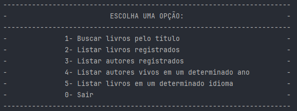

# Literature API 

<div align="center">

[](https://opensource.org/licenses/MIT)
[](https://www.java.com/)
[]()
[]()

[](https://spring.io/projects/spring-boot)
[](https://hibernate.org/)
[](https://maven.apache.org/)
[](postgresql.org/)

</div>

## Sobre
Esta API de gestão de livros foi desenvolvida como parte do Challenge ONE, um desafio destinado a explorar Java e Spring Boot.

<div>
    
</div>


## Funcionalidades

- **Buscar livros pelo título**: Consulta a API Gutendex para buscar livros pelo título.
- **Listar livros registrados**: Exibe todos os livros registrados no banco de dados.
- **Listar autores registrados**: Exibe todos os autores dos livros registrados.
- **Listar autores vivos em um determinado ano**: Lista autores que estavam vivos em um ano especificado.
- **Listar autores nascidos em determinado ano**: Lista autores que nasceram em um ano especificado.
- **Listar autores por ano de sua morte**: Lista autores que morreram em um ano especificado.
- **Listar livros em um determinado idioma**: Lista livros registrados no banco de dados em um idioma especificado.
- **Encerrar a aplicação**: Encerra o programa.


<h4>1. Instalação de Dependências:</h4>

```bash
mvn install
```

Este comando irá baixar as dependências do projeto e construir o projeto. Ele executa as fases `compile`, `test`, e `package` do ciclo de vida do Maven.

<h4>2. Configuração do Banco de Dados PostgreSQL:</h4>

**Observação:**
O PostgreSQL deve sempre estar aberto. Caso contrário, a API encerrará sua execução, informando que não encontrou o banco de dados.

- Instale o [PostgreSQL](https://www.postgresql.org/download/)
- Configure a senha do banco de dados no arquivo `src/main/resources/application.properties` na propriedade `spring.datasource.password`. Esta senha deve corresponder a mesma configurada no PostgreSQL.
- Configure o usuário do banco de dados no arquivo `src/main/resources/application.properties` na propriedade `spring.datasource.username`. Este usuário deve corresponder o mesmo configurado no PostgreSQL.
- Abra o PostgreSQL e crie um **Banco de Dados** chamado `literature` ou se preferir coloque o nome no que preferir em `src/main/resources/application.properties` na propriedade `spring.datasource.url`.

<h4>3. Execução do Projeto:</h4>

```bash
mvn spring-boot:run
```

- Se quiser parar de executar aperte as teclas ```ctrl + c```
- Se no terminal perguntar ``Deseja finalizar o arquivo em lotes (S/N)?`` responda ``S``

<h4>4. Limpeza do Projeto:</h4>

```bash
mvn clean
```

Este comando remove os arquivos gerados durante a compilação e construção do projeto. Isso é útil se você deseja limpar o projeto antes de construir novamente.

## Licença

Este projeto está licenciado sob a [Licença MIT](LICENSE).
